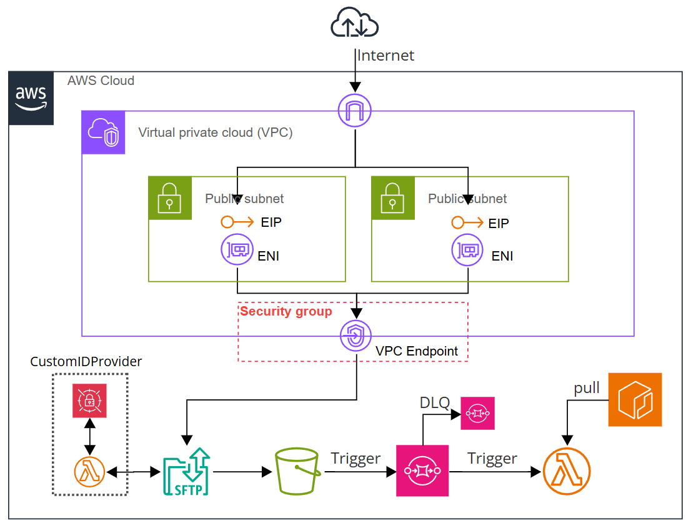

# File Upload Workflow using SFTP

## Overview

This Terraform configuration sets up a workflow that uses AWS Transfer Family to configure an SFTP server for uploading files to an S3 bucket. Uploaded files are managed through SQS queues and processed by Lambda functions.

## Architecture


## Authentication Methods

The SFTP server supports two authentication methods:

1. **SSH Key Authentication**
   - Secure public key-based authentication
   - Users provide their public SSH key
   - Recommended for automated processes and enhanced security

2. **Password Authentication**
   - Traditional username/password authentication
   - Suitable for users who prefer password-based login
   - Password must meet AWS Transfer Family security requirements

Users can be configured to use either authentication method based on their needs.

## Key Features

- SFTP server configuration using AWS Transfer Family
- IP restriction using VPC(Internet Facing) + VPC Endpoint
- File upload to S3 bucket
- Lambda function execution control using SQS
- File processing using Lambda functions

## Setup Instructions

1. Clone this repository
2. Create a `terraform.tfvars` file and configure the required variables
3. Run `terraform init` to initialize Terraform
4. Run `terraform plan` to review the resources to be created
5. Run `terraform apply` to deploy the infrastructure

## terraform.tfvars Configuration

Configure the following variables in your `terraform.tfvars` file:

### Required Variables

```hcl
# S3 bucket name
s3_bucket_name = "my-sftp-bucket"

# SFTP users configuration
sftp_users = [
  {
    user_name  = "sftp-user001"
    ssh_key    = "ssh-ed25519 AAAA..."  # Either ssh_key or password is required
    ip_address = "192.0.2.10/32"
  },
  {
    user_name  = "sftp-user002"
    password   = "********"  # Either ssh_key or password is required
    ip_address = "198.51.100.20/32"
  }
]
```

### Optional Variables

```hcl
# Lambda function settings (optional)
lambda_settings = {
  timeout        = 180  # seconds (1-900)
  retry_attempts = 0
  memory_size    = 128  # MB (128-10240)
}

# SQS settings (optional)
sqs_settings = {
  max_receive_count          = 5
  visibility_timeout_seconds = 240  # seconds (0-43200)
  dlq_message_retention_days = 14   # days (1-14)
}
```

Note: If optional variables are not specified, default values will be used.
